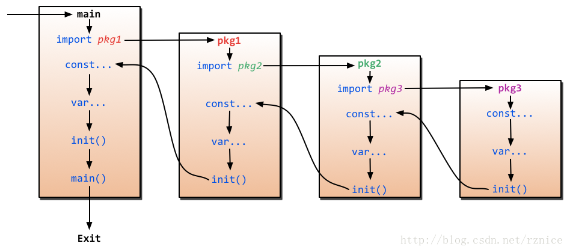

```
引入包顺序：
	import 包 
		检查引用的包是否还引用了其他包
			继续引入其他包				
				初始化包级常量和变量进行
				执行 init()  函数			
			初始化包级常量和变量进行
			执行 init()  函数
		初始化包级常量和变量进行
		执行 init()  函数
		
初始化包级常量和变量进行
mian包init()
main()
```
引入包顺序：
(图片引用：https://blog.csdn.net/rznice/article/details/18987047)

