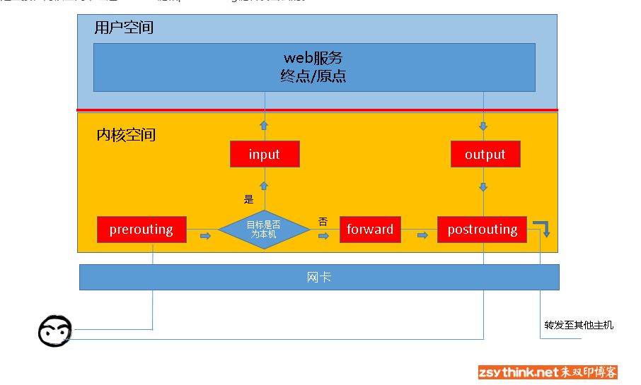
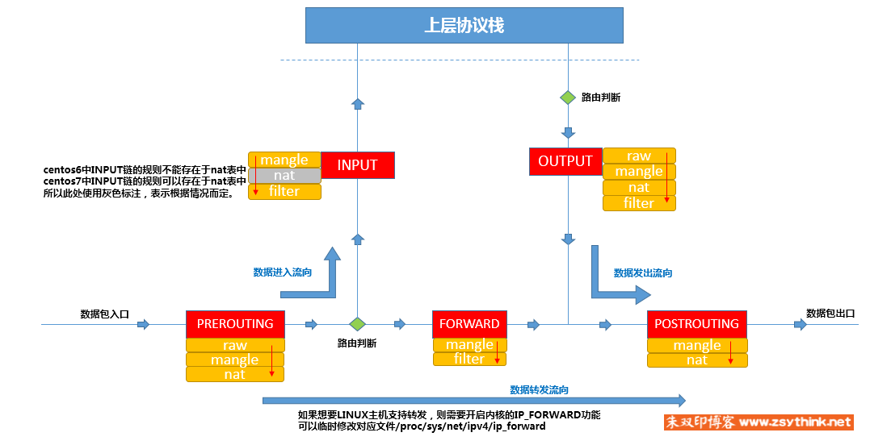

参考：

<http://www.zsythink.net/archives/1199/>

<https://blog.51cto.com/13677371/2094355>


```
iptables 管理内核的netfilter
```


防火墙服务

```bash
systemctl status iptables.service 
```

```
链：
PREROUTING
INPUT
POSTROUTING
OUTPUT
FORWARD

```





表：

```
filter表	（实现包过滤）
nat表	（实现网络地址转换）
mangle表	（实现包修改）
raw表	（实现数据跟踪）
这些表具有一定的优先级：**raw-->mangle-->nat-->filter
```


链表：


```
查看
iptables -L

清除
iptables -F
iptables -X 
```

```
动作选项
     ACCEPT          接收数据包
     DROP             丢弃数据包
     REDIRECT      将数据包重新转向到本机或另一台主机的某一个端口，通常功能实现透明代理或对外开放内网的某些服务
     SNAT             源地址转换
     DNAT             目的地址转换
     MASQUERADE       IP伪装
     LOG               日志功能
     
     
-A 增加	-I 插入	-D 删除	-R 替换     
     
iptables [-t 表名] <-A|I|D|R> 链名 [规则编号] [-i|o 网卡名称] [-p 协议类型] [-s 源ip|源子网] [--sport 源端口号] [-d 目的IP|目标子网] [--dport 目标端口号] [-j 动作]     
```


```bash
禁ping
iptables -A INPUT -p icmp --icmp-type 8 -i <网卡名>  -s 0.0.0.0/0 -j DROP
或
iptables -A INPUT -p icmp  --icmp-type 8  -j DROP
```

```
允许合法网段ip接入
iptables -A INPUT -s <10.0.0.0/24> -p  all -j ACCEPT 
```


nat 分snat 和dnat  : 

参考:

<http://www.zsythink.net/archives/1764>

<https://blog.51cto.com/13162375/2103512>

```
虚拟机使用 hostonly 网络环境：

宿主机：

snat:  (实现虚拟机上外网)
# iptables -N fw-open
# iptables -A FORWARD -j fw-open 
# iptables -t nat -A POSTROUTING -o <hostonly网卡>  -s 192.168.4.0/24 -j MASQUERADE
(iptables -t nat -A POSTROUTING -o <hostonly网卡>  -s (虚拟机网段) -j MASQUERADE)


dnat:    (参考 https://www.cnblogs.com/jjzd/p/6505871.html)
（
实现虚拟机中的端口能被宿主机所在局域网的其他网络设备访问。
注：宿主机不能通过<宿主机ip>：<宿主机端口> 访问虚拟机端口
）
# iptables -t nat -A PREROUTING -d <宿主机ip> -p tcp -m tcp --dport <宿主机端口>  -j DNAT --to-destination 192.168.4.11:22

（iptables -t nat -A PREROUTING -d <宿主机ip> -p tcp -m tcp --dport <宿主机端口>  -j DNAT --to-destination <虚拟机ip>:<虚拟机端口>）

```


```
端口转发:

同端口转发(  :3389    192.168.4.13:3389 )

iptables -t nat -I PREROUTING -p tcp --dport 3389 -j DNAT --to 192.168.4.13
iptables -t nat -I POSTROUTING -p tcp --dport 3389 -j MASQUERADE


不同端口转发(192.168.2.231:3388    192.168.4.13:3389 )

iptables -t nat -A PREROUTING -p tcp -m tcp --dport 3388 -j DNAT --to-destination 192.168.4.13:3389
iptables -t nat -A POSTROUTING -s 192.168.4.0/24  -d 192.168.4.13 -p tcp -m tcp --dport 3389 -j SNAT  --to-source 192.168.2.231
```

